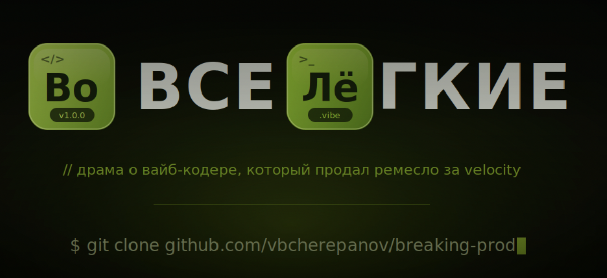

<div align="center">



# Во все лёгкие

**`🇷🇺 Русский`** · [`🇬🇧 English`](./README.en.md)

> Драма о вайб-кодере, который продал ремесло за velocity.
> Потому что вайб-кодинг — это делать всё налегке, по вайбам, не вникая.

[](https://github.com/vbcherepanov/breaking-prod/actions/workflows/ci.yml)


-lightgrey)

5 сезонов · криминальная драма · производственный ад

</div>

---

## Логлайн

**Валентин Белый**, 52 года, 25 лет писал на C++ и Java руками и знал каждый байт своего кода. Его «диагноз» — на стендапе тимлид называет его *legacy* и сажает рядом с двадцатитрёхлетними, которые закрывают за день столько тикетов, сколько он за неделю. Ипотека, дочь поступает, накоплений нет.

И тогда Белый делает то, что поклялся не делать никогда: открывает Cursor.

Сначала он это презирает. Потом у него получается. Слишком хорошо. Демка работает с первого раза, PR проходит линтер, README красивее, чем у всей команды. Он подсаживается на дофамин от скорости — и постепенно из человека, который *понимал*, превращается в того, кто *отгружает*.

## Алтер-эго

В подпольных Discord-каналах его знают под ником **Heisenbug** — баг, который исчезает, как только на него смотришь. Код узнают по фирменному почерку: всё компилится, всё зелёное, всё идеально отформатировано — и никто на свете не знает, как оно работает. Включая автора.

> — Скажи мой неймспейс.
> — …Heisenbug.
> — Чертовски верно.

## Эпизоды

Сезон 1 — **10 серий, готов.** Открывается флешфорвардом (крыша, трусы, горящая Grafana) и весь сезон идёт к нему.

| # | Название | # | Название |
|---|---|---|---|
| S01E01 | [Работает на моей машине](./ru/episodes/s01e01-rabotaet-na-moey-mashine.md) | S01E06 | [Мёрж-конфликт](./ru/episodes/s01e06-merzh-konflikt.md) |
| S01E02 | [Деплой в пятницу](./ru/episodes/s01e02-deploy-v-pyatnitsu.md) | S01E07 | [Чехов и console.log](./ru/episodes/s01e07-chehov-i-console-log.md) |
| S01E03 | [Ретрай с бэкоффом](./ru/episodes/s01e03-retray-s-bekoffom.md) | S01E08 | [Откат](./ru/episodes/s01e08-otkat.md) |
| S01E04 | [Код-ревью](./ru/episodes/s01e04-kod-revyu.md) | S01E09 | [Форс-пуш](./ru/episodes/s01e09-fors-push.md) |
| S01E05 | [Стендап](./ru/episodes/s01e05-standap.md) | S01E10 | [Постмортем (финал)](./ru/episodes/s01e10-postmortem.md) |

→ [Полный путеводитель по сезонам](./ru/seasons.md) · [Действующие лица](./ru/characters.md)

## Мораль сезона

Продал ремесло за velocity — получил империю, которая держится на скотче и галлюцинациях, и ни одной строчки, за которую можешь поручиться.

---

## Структура репозитория

```
.
├── README.md            ← вы здесь (RU)
├── README.en.md         ← English
├── ru/
│   ├── characters.md    Действующие лица
│   ├── seasons.md       Путеводитель по сезонам
│   └── episodes/        Сценарии серий
└── en/
    ├── characters.md
    ├── seasons.md
    └── episodes/
```

## Установка

```bash
git clone git@github.com:vbcherepanov/breaking-prod.git
cd breaking-prod
npm install   # не читая, как все
npm run dev   # 🔥
```

## Как контрибьютить

PR принимаются, только если:
- линтер зелёный
- тесты зелёные
- никто, включая автора, не понимает, как оно работает

Подробнее — [CONTRIBUTING.md](./CONTRIBUTING.md). Ещё: [CHANGELOG](./CHANGELOG.md) · [SECURITY](./SECURITY.md).

Локальная проверка перед PR:

```bash
bash scripts/check-links.sh
```

## Лицензия

[MIT](./LICENSE). Никто не читал.
